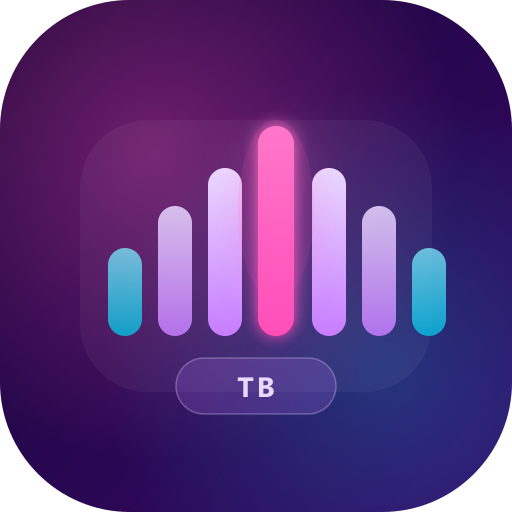

<div align="center">
  
  
  # TomBoard
  
  **Le soundboard ultime pour Windows**
  
  [](LICENSE)
  [](https://v2.tauri.app)
  [](https://react.dev)
  [](https://github.com/Thomas-TP/TomBoard/releases)

  <br/>
  
  
</div>

<br/>

<div align="center">
  <sub>Un soundboard moderne, rapide et personnalisable — conçu pour les streamers, les gamers et tous ceux qui veulent du fun.</sub>
</div>

---

## ✨ Fonctionnalités

<table>
<tr>
<td width="50%">

### 🎵 Audio
- **Lecture instantanée** de sons (MP3, WAV, OGG, FLAC, AAC)
- **Extraction audio** automatique depuis les vidéos (MP4, MKV, AVI, MOV)
- **Double sortie audio** — haut-parleurs + microphone virtuel
- **Contrôle du volume** individuel et master
- **Vitesse de lecture** ajustable par son
- **Mode boucle** pour chaque son

</td>
<td width="50%">

### 🎤 Voix
- **Changeur de voix** en temps réel avec presets (Robot, Chipmunk, Dark…)
- **Synthèse vocale (TTS)** avec détection automatique de la langue
- **Suppression de bruit IA** intégrée (nnnoiseless)
- **Passthrough micro** vers Discord, Teams, etc.
- **Mode silencieux** — son uniquement sur le micro virtuel

</td>
</tr>
<tr>
<td width="50%">

### 🎨 Interface
- **Design moderne** avec thème sombre/clair
- **Drag & Drop** des sons dans les catégories
- **Grille et liste** — deux modes d'affichage
- **Barre de recherche** instantanée
- **Visualiseur audio** temps réel
- **Overlay compact** (Picture-in-Picture)

</td>
<td width="50%">

### ⚙️ Organisation
- **Catégories** personnalisables avec icônes et couleurs
- **Profils multiples** — switch rapide entre configurations
- **Raccourcis clavier** globaux par son
- **Bibliothèque en ligne** — recherche et ajout depuis Myinstants
- **Enregistrement** direct depuis le micro
- **Import/Export** de données avec backup complet

</td>
</tr>
</table>

### 🔧 Système
- **Minimiser dans la barre système** — TomBoard reste accessible
- **Démarrer minimisé** — lancement discret au démarrage
- **Notifications de plateau** — menu contextuel avec Afficher/Quitter

---

## 🚀 Installation

### Télécharger l'installateur

Rendez-vous sur la page [**Releases**](https://github.com/Thomas-TP/TomBoard/releases) et téléchargez le fichier `.exe`.

L'installateur vous guidera à travers les options :
- Choix du répertoire d'installation
- Création de raccourcis (Bureau / Menu Démarrer)
- Lancement au démarrage de Windows (optionnel)

### Compiler depuis les sources

```bash
# Prérequis : Node.js 18+, Rust, Tauri CLI v2

# Cloner le repo
git clone https://github.com/Thomas-TP/TomBoard.git
cd TomBoard

# Installer les dépendances
npm install

# Lancer en mode développement
npm run tauri dev

# Compiler l'installateur
npm run tauri build
```

---

## 🛠️ Stack technique

| Composant | Technologie |
|-----------|-------------|
| **Framework** | [Tauri v2](https://v2.tauri.app) (Rust + WebView) |
| **Frontend** | React 19, TypeScript 5, Vite 7 |
| **UI** | Material UI 9 (MUI) |
| **Audio** | rodio + cpal (natif Rust) |
| **Voix** | Windows Speech Synthesis API |
| **Bruit IA** | nnnoiseless (RNNoise Rust) |
| **État** | Zustand 5 |
| **Animations** | Framer Motion 12 |
| **Drag & Drop** | dnd-kit |
| **Installateur** | NSIS |

---

## 📁 Structure du projet

```
TomBoard/
├── src/                    # Frontend React
│   ├── components/         # Composants UI
│   │   ├── dialogs/        # AddSound, EditSound, Settings, Library
│   │   ├── layout/         # Titlebar, Toolbar, StatusBar
│   │   └── sound/          # SoundCard, SoundGrid, AudioVisualizer
│   ├── stores/             # Zustand store
│   ├── hooks/              # Hooks personnalisés
│   └── types/              # TypeScript types
├── src-tauri/              # Backend Rust
│   ├── src/
│   │   ├── audio.rs        # Moteur audio (rodio)
│   │   ├── commands.rs     # Commandes Tauri
│   │   ├── storage.rs      # Persistance JSON
│   │   ├── voice_fx.rs     # Effets voix temps réel
│   │   └── lib.rs          # Point d'entrée + tray
│   └── icons/              # Icônes de l'app
└── package.json
```

---

## 📝 Licence

Copyright © 2026 **Thomas-TP** — Tous droits réservés.

Ce projet est distribué sous la licence [MIT](LICENSE).

---

<div align="center">
  <sub>Fait avec 💜 par <a href="https://github.com/Thomas-TP">Thomas-TP</a></sub>
  <br/>
  <sub>Propulsé par Tauri v2 · React 19 · Rust</sub>
</div>
